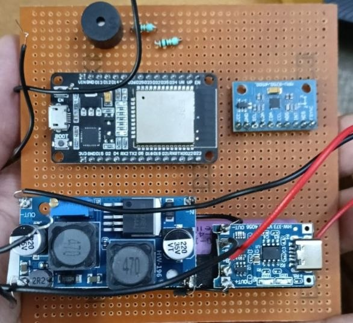
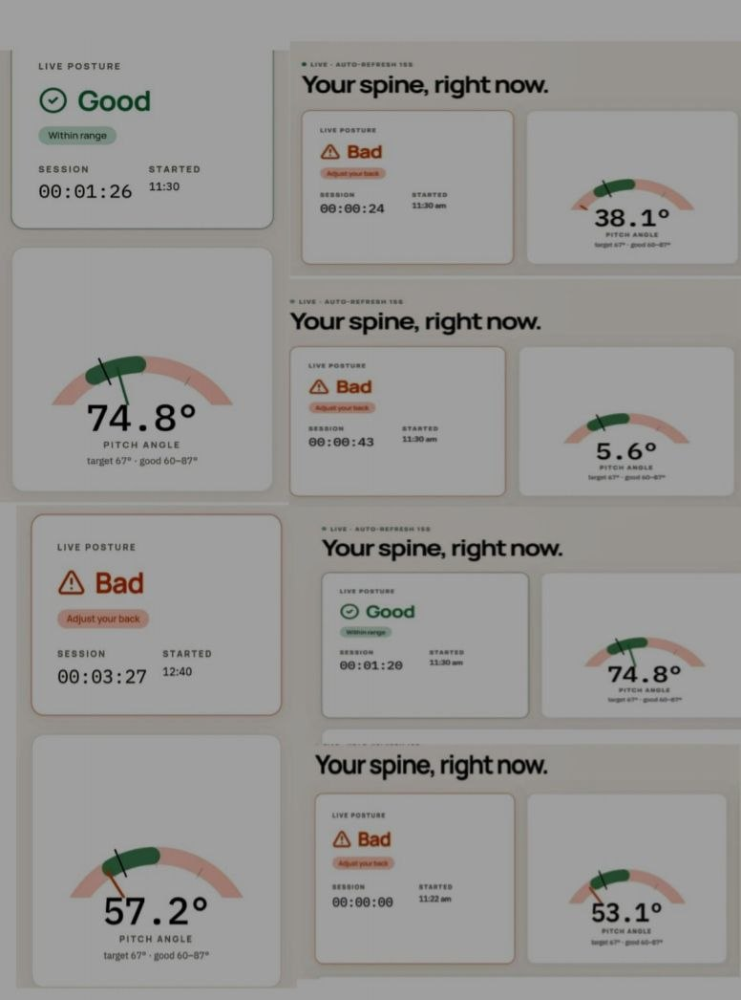
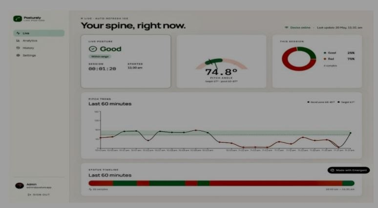
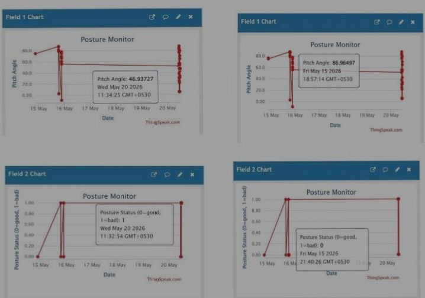
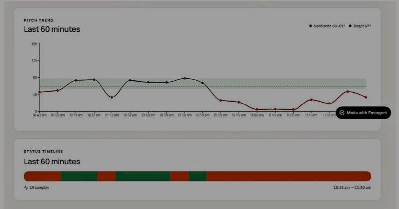

# POSTURA — Smart Posture Monitoring & Wellness System

An IoT-based wearable system designed to help users monitor their posture in real time, receive corrective alerts, and track posture patterns over time.

## Overview

Prolonged sitting and poor posture are common challenges in today's increasingly sedentary lifestyle. People often become unaware of their posture during busy routines and may continue sitting incorrectly for extended periods.

The idea for POSTURA came from observing this everyday problem and identifying the need for continuous posture awareness rather than relying only on occasional reminders.

POSTURA is a wearable IoT prototype that detects posture and provides real-time corrective feedback through alerts, while also connecting to a mobile dashboard for monitoring and tracking posture-related data.

## Problem Statement

People often struggle to maintain correct posture consistently because:

- Poor posture can go unnoticed for long periods.
- Users may forget to correct their sitting position.
- Occasional reminders do not provide continuous monitoring.
- Users have limited visibility into their posture patterns over time.
- There is a need for a simple and accessible way to improve posture awareness.

## Proposed Solution

POSTURA combines wearable sensing, embedded processing, real-time alerts, and mobile monitoring to create a continuous posture-awareness system.

The system is designed to:

- Detect posture in real time.
- Provide immediate corrective alerts when incorrect posture is detected.
- Display posture information through a mobile dashboard.
- Enable users to track posture patterns over weeks and months.
- Encourage healthier daily habits through wellness reminders.

## Key Features

- Real-time posture monitoring
- Wearable device
- Corrective buzzer/alerts
- Mobile monitoring dashboard
- Historical posture tracking
- Long-term posture trend analysis
- Wellness reminders for hydration, movement, and rest
- Potential application in physiotherapy and personal wellness monitoring

## How It Works

User
↓
Wearable Posture Monitoring Device
↓
Motion / Posture Sensors
↓
Microcontroller
↓
Posture Detection
↓
Correct Posture → Continue
Incorrect Posture → Alert User
↓
Mobile Dashboard
↓
Historical Tracking

## Technology

- ESP32 / Microcontroller
- IMU / Motion Sensor
- Embedded Programming
- IoT Connectivity
- Mobile Dashboard
- Data Monitoring and Visualization

- ## Source Code

The ESP32 firmware is provided in [postura.ino](postura.ino).

The code implements:

- MPU6050-based posture sensing
- Pitch-angle calculation
- Good/bad posture classification
- Real-time buzzer alerts
- Wi-Fi connectivity
- ThingSpeak data transmission
- Posture status monitoring

## Product Perspective

The project was approached not only as a hardware prototype but also as a user-focused product concept.

The development process involved:

1. Observing a recurring everyday problem.
2. Identifying the need for continuous posture awareness.
3. Designing a wearable solution around the user's routine.
4. Implementing real-time corrective feedback.
5. Connecting the device to a monitoring dashboard.
6. Exploring long-term tracking and wellness applications.

## Current Status

A working prototype was developed to demonstrate wearable posture monitoring, real-time corrective alerts, and mobile-based tracking.

The project was presented at an ideathon, where the problem, proposed solution, feasibility, and potential real-world applications were explored.

## Future Development

The project is planned for further development as a major academic project, with a focus on integrating:

- AI-based posture-pattern analysis
- Personalized recommendations
- Adaptive alerts
- Long-term behavioral insights
- Predictive wellness insights
- Additional health and activity data

## Long-Term Vision

The long-term vision of POSTURA is to evolve from a simple posture-correction device into a personalized wellness-support platform by combining wearable sensing, longitudinal data, and intelligent recommendations.

## Disclaimer

POSTURA is a prototype and wellness-monitoring concept. It is not intended to diagnose, treat, or prevent medical conditions.

## Project Screenshots

### 1. Wearable Posture Device Prototype

### 2. Real-Time Posture Monitoring

### 3. Posture Monitoring Dashboard

### 4. Posture Data Analytics

### 5. Posture Trend and Status Timeline

